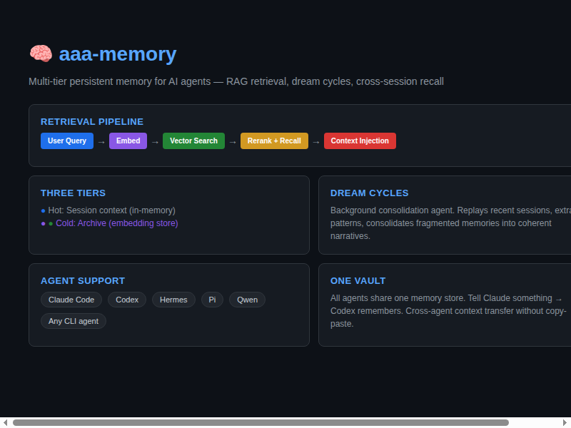

# aaa-memory



[](https://github.com/aaaronmiller/aaa-memory)
[](https://python.org)

**Multi-tier persistent memory for AI agents.** One vault, every agent, cross-session recall.

> Everything you've ever told any AI — searchable from all of them.

## Install (pick your agent)

### Hermes (recommended)

```bash
# 1. Clone and install
git clone https://github.com/aaaronmiller/aaa-memory.git ~/code/aaa-memory
cd ~/code/aaa-memory && pip install -e .

# 2. Install Cass session search and refresh cron
#    See "Cass session search setup" below.

# 3. Plugin is auto-discovered — just set provider
# Add to ~/.hermes/config.yaml under memory:
#   provider: aaa-memory

# 4. Restart gateway
hermes gateway restart
```

### Claude Code

```bash
# 1. Clone and install
git clone https://github.com/aaaronmiller/aaa-memory.git ~/code/aaa-memory
cd ~/code/aaa-memory && pip install -e .

# 2. Install Cass session search and refresh cron
#    See "Cass session search setup" below.

# 3. Add to ~/.claude/CLAUDE.md:
#    ## aaa-memory
#    python3 ~/code/aaa-memory/scripts/mem.py recall "<query>" --limit 6
#    To store: python3 ~/code/aaa-memory/scripts/mem.py save "<fact>" --source claude-code

# 4. Optional: start MCP server for tool access
#    Add to ~/.claude/settings.json mcpServers:
#    "aaa-memory": { "command": "python3", "args": ["-m", "aaa_memory.mcp"] }
```

### Pi (coding agent)

```bash
# 1. Clone and install
git clone https://github.com/aaaronmiller/aaa-memory.git ~/code/aaa-memory
cd ~/code/aaa-memory && pip install -e .

# 2. Install Cass session search and refresh cron
#    See "Cass session search setup" below.

# 3. Pi auto-discovers skills in ~/.pi/agent/skills/
#    The goal-loop skill is already installed.
#    For memory access, add to your AGENTS.md:
#    ## Memory
#    Use `python3 ~/code/aaa-memory/scripts/mem.py recall "<query>"` to search memory.
```

### Codex / OpenCode / Agy (Antigravity)

```bash
# 1. Clone and install
git clone https://github.com/aaaronmiller/aaa-memory.git ~/code/aaa-memory
cd ~/code/aaa-memory && pip install -e .

# 2. Install Cass session search and refresh cron
#    See "Cass session search setup" below.

# 3. Add to your agent's system prompt or config:
#    ## Persistent Memory
#    Search: python3 ~/code/aaa-memory/scripts/mem.py recall "<query>"
#    Store:  python3 ~/code/aaa-memory/scripts/mem.py save "<fact>" --source <agent-name>
```

### Any agent with hooks support

```bash
# Generic install
pip install -e .

# Install Cass session search and refresh cron.
# See "Cass session search setup" below.

# Use the CLI directly:
python3 ~/code/aaa-memory/scripts/mem.py recall "what did we decide about X?"
python3 ~/code/aaa-memory/scripts/mem.py save "user prefers dark mode" --tags preference
```

## Cass session search setup

Cass is required for raw coding-agent session evidence. `aaa-memory` uses its own vault for durable memory, while Cass keeps historical agent transcripts indexed and searchable.

Install Cass:

```bash
curl -fsSL "https://raw.githubusercontent.com/Dicklesworthstone/coding_agent_session_search/main/install.sh?$(date +%s)" \
  | bash -s -- --easy-mode --verify
```

Initialize or refresh the Cass index:

```bash
cass triage --json
cass index --json --no-progress-events --data-dir "$HOME/.local/share/coding-agent-search"
```

Install the four-times-daily refresh cron job:

```bash
CASS_BIN="$(command -v cass)"
mkdir -p "$HOME/.cache/aaa-memory/logs"
( crontab -l 2>/dev/null | grep -v 'aaa-memory cass refresh'; \
  printf '0 */6 * * * %s index --json --no-progress-events --data-dir "$HOME/.local/share/coding-agent-search" >> "$HOME/.cache/aaa-memory/logs/cass-index.log" 2>&1 # aaa-memory cass refresh\n' "$CASS_BIN" ) | crontab -
```

Verify:

```bash
cass triage --json
crontab -l | grep 'aaa-memory cass refresh'
```

Optional semantic refinement:

```bash
cass models install --model all-minilm-l6-v2
```

Semantic models are explicit opt-in. Without them, Cass remains usable through lexical search and reports fallback metadata in robot output.

## Architecture

```
┌─────────────────────────────────────────────────────────────────┐
│                        Unified Retrieval                        │
│              Intent classify → Route → RRF fusion               │
├──────────┬──────────────────┬──────────────────────────────────┤
│ Hot Tier │    Warm Tier     │           Cold Tier              │
│          │                  │                                  │
│ SQLite   │  Dream Agent     │  ClawMem FTS (REST API)         │
│ vault    │  → wiki pages    │  + local FTS5 fallback           │
│ + FTS5   │  → skill create  │  (386 docs indexed)             │
│ (11 mem) │  → improve       │                                  │
├──────────┴──────────────────┴──────────────────────────────────┤
│       Cass raw session evidence, refreshed by cron every 6h      │
├─────────────────────────────────────────────────────────────────┤
│                    Agent Integrations                           │
│  Hermes plugin │ Claude hooks │ MCP server │ CLI │ Pi skills   │
└─────────────────────────────────────────────────────────────────┘
```

## Storage

| What | Where | Format |
|------|-------|--------|
| Vault (turns, memories, wiki pages) | `~/.cache/aaa-memory/vault.sqlite` | SQLite + FTS5 |
| Wiki pages (filesystem) | `~/ai-wiki/pages/` | Markdown + YAML frontmatter |
| Raw intake | `~/ai-wiki/raw/` | Any file |
| Cass session index | `~/.local/share/coding-agent-search` | Cass SQLite + derived search assets |
| Cass refresh log | `~/.cache/aaa-memory/logs/cass-index.log` | Cron output |
| ClawMem index | `~/.cache/clawmem/index.sqlite` | SQLite + FTS |
| Hot memories | `vault.sqlite → hot_memories` | JSON tags, pinned flag |
| Skill patterns | `~/ai-wiki/.meta/skill_patterns.json` | JSON |

## Commands

### User CLI (`scripts/mem.py`)

```bash
# Store a memory
python3 ~/code/aaa-memory/scripts/mem.py save "user prefers deepseek over minimax" --tags preference --project hermes

# Search memories
python3 ~/code/aaa-memory/scripts/mem.py recall "what model does the user prefer?" --limit 5

# List recent memories
python3 ~/code/aaa-memory/scripts/mem.py list --limit 10

# Inject context block (for hooks)
python3 ~/code/aaa-memory/scripts/mem.py inject --limit 6

# Delete a memory
python3 ~/code/aaa-memory/scripts/mem.py forget "outdated fact"

# Capture from transcript
python3 ~/code/aaa-memory/scripts/mem.py capture /path/to/transcript.jsonl --source claude-code

# Show stats
python3 ~/code/aaa-memory/scripts/mem.py stats
```

### System CLI (`aaa-memory`)

```bash
aaa-memory sessions              # List discovered agent sessions
aaa-memory timeline <project>    # Generate project timeline
aaa-memory report                # System status report
aaa-memory search "query"        # Search across all tiers
aaa-memory audit                 # Run session discovery
```

### Cass session evidence

```bash
cass triage --json
cass search "query" --robot --robot-meta --fields summary --limit 5
cass pack "query" --robot --max-tokens 12000 --limit 40
```

Do not run bare `cass` from automation. Bare `cass` opens the interactive TUI.

### MCP Tools (for Claude Code, Hermes, or any MCP client)

```bash
# Start MCP server
python3 -m aaa_memory.mcp

# Tools exposed:
#   memory_search(query, limit)    — hybrid retrieval
#   memory_sessions(project_id)    — list sessions
#   memory_timeline(project, days) — project timeline
#   memory_store(agent, data)      — store a turn
```

### Hermes Tools (via plugin)

The Hermes plugin automatically exposes:
- `aaa_memory_search(query, limit)` — search persistent memory
- `aaa_memory_store(content, category)` — store a fact

### Dream Agent (sleep-time compute)

```bash
# Run manually
python3 ~/code/aaa-memory/src/aaa_memory/warm/dream.py --idle 600

# Quiet mode (for cron/hooks)
python3 ~/code/aaa-memory/src/aaa_memory/warm/dream.py --quiet --idle 60
```

## Agent Integration Matrix

| Agent | Integration | Status | Same Vault? |
|-------|-------------|--------|-------------|
| **Hermes** | Plugin (MemoryProvider) | ✅ Active | Yes |
| **Pi** | Skills + AGENTS.md | ✅ Active | Yes |
| **Claude Code** | CLAUDE.md + MCP | ✅ Active | Yes |
| **Codex** | System prompt | ✅ Stubs ready | Yes |
| **OpenCode** | System prompt | ✅ Stubs ready | Yes |
| **Agy (Antigravity)** | System prompt | ✅ Stubs ready | Yes |
| **OpenRouter** | Via Hermes | ✅ Through plugin | Yes |

**All agents share the same vault** at `~/.cache/aaa-memory/vault.sqlite`.

## Configuration

### Config format: environment variables + YAML

```bash
# ~/.config/aaa-memory/config.yaml (optional — defaults work out of the box)
vault_path: ~/.cache/aaa-memory/vault.sqlite
wiki_path: ~/ai-wiki/pages
raw_path: ~/ai-wiki/raw

# Or use env vars:
export AAA_VAULT=~/.cache/aaa-memory/vault.sqlite
export AAA_WIKI=~/ai-wiki/pages
export AI_WIKI=~/ai-wiki
```

### ClawMem config: `~/.config/clawmem/index.yml`

```yaml
collections:
  wiki:
    path: ~/ai-wiki/pages
    pattern: "**/*.md"
  aaa-memory:
    path: ~/.cache/aaa-memory
    pattern: "**/*.md"
```

## Classification

The classifier uses **rule-based + LLM fallback**:

| Category | Detection | Example |
|----------|-----------|---------|
| `transcript` | Rules: agent names, turn patterns | Claude/Codex session logs |
| `prd` | Rules: requirements, user stories | Product specs |
| `research_paper` | Rules: arxiv, abstract, citations | Papers |
| `knowledge_extract` | Rules: code, config, docs | Technical docs |

Rules fire first (fast, free). LLM classifies only when rules are uncertain.

## Dream Agent (Sleep-Time Compute)

Runs during idle time to compile knowledge into wiki pages.

### What it processes

1. **Vault turns** — recent conversations (last 7 days)
2. **Hot memories** — stored facts
3. **Raw intake** — files in `~/ai-wiki/raw/`

### What it creates

1. **Wiki pages** — YAML frontmatter, `[[wikilinks]]`, confidence scores
2. **Auto-skills** — when 3+ similar tasks detected, creates Pi skill
3. **Improvements** — fixes missing frontmatter, broken links

### Defaults

| Setting | Default | Env var |
|---------|---------|---------|
| Confidence threshold | 0.3 | `CONFIDENCE_AUTO` |
| Skill creation threshold | 3 patterns | `SKILL_CREATION_THRESHOLD` |
| Budget ratio | idle_seconds × 0.25, max 7200s | — |
| Intake ratio | 40% of budget | — |
| Compile ratio | 30% of budget | — |
| Improve ratio | 20% of budget | — |
| Lint ratio | 10% of budget | — |

### File selection during sleep

The dream agent processes files in this priority:
1. **New raw files** — anything in `~/ai-wiki/raw/` not yet in `intake_log.jsonl`
2. **Recent vault turns** — last 7 days, newest first
3. **All hot memories** — every stored fact

Budget-capped: stops when time runs out, resumes next cycle.

## Vector Encoding

### ClawMem

| Setting | Value |
|---------|-------|
| Engine | node-llama-cpp (local) or OpenAI-compatible API |
| Local model | GGUF embedding model (bundled) |
| Cloud endpoint | `http://localhost:8088/v1/embeddings` (configurable) |
| Tokenizer | Model-native (llama.cpp auto-detect) |
| Fragment size | 500-2000 chars (section-based splitting) |

### aaa-memory vault

| Setting | Value |
|---------|-------|
| FTS5 | SQLite built-in tokenizer (`porter unicode61`) |
| Vector | sqlite-vec (optional, not yet wired) |
| Search | FTS5 keyword + intent routing |

### Local vs Cloud

```bash
# Local (default, no API key needed)
clawmem embed  # uses bundled GGUF model

# Cloud (optional)
export CLAWMEM_EMBED_URL="https://api.openai.com/v1/embeddings"
export CLAWMEM_EMBED_API_KEY="sk-..."
clawmem embed
```

## Setup Wizard

```bash
# Quick setup (recommended)
cd ~/code/aaa-memory
python3 -m aaa_memory.setup

# Or manual:
pip install -e .
mkdir -p ~/ai-wiki/{raw,pages/{concepts,entities,sources,queries}}
clawmem init
clawmem collection add ~/ai-wiki/pages --name wiki
clawmem update --embed
```

## Remote Access

### Local network

ClawMem serves on `127.0.0.1:7438` by default. To expose on LAN:

```bash
clawmem serve --host 0.0.0.0 --port 7438
```

### Tailscale (anywhere access)

```bash
# On the host machine
tailscale serve --bg 7438

# From any Tailscale-connected device
curl http://<hostname>:7438/health
```

### VPN / SSH tunnel

```bash
ssh -L 7438:localhost:7438 user@host
```

## Web UI

The web UI is in development (`src/aaa_memory/ui/`). Current status:

- **Metrics dashboard** — session counts, memory stats, tier sizes
- **Memory browser** — search, view, edit, delete memories
- **Settings** — config.yaml editor, ClawMem status
- **Dream log** — view dream agent cycles and outputs

```bash
# Start web UI (when available)
python3 -m aaa_memory.ui.server
# Opens at http://localhost:8080
```

## Systemd Services

| Service | Command | Purpose |
|---------|---------|---------|
| `clawmem-serve` | `systemctl --user start clawmem-serve` | REST API on :7438 |
| `clawmem-watcher` | `systemctl --user start clawmem-watcher` | File watcher |
| `model-scan-update` | `systemctl --user start model-scan-update` | Weekly AA cache refresh |

## Troubleshooting

```bash
# Check vault status
python3 ~/code/aaa-memory/scripts/mem.py stats

# Check ClawMem
curl http://localhost:7438/health
clawmem collection list

# Check Hermes plugin
hermes memory status

# Re-index ClawMem
clawmem update --embed

# Run dream agent manually
python3 ~/code/aaa-memory/src/aaa_memory/warm/dream.py --idle 60
```

## License

MIT
