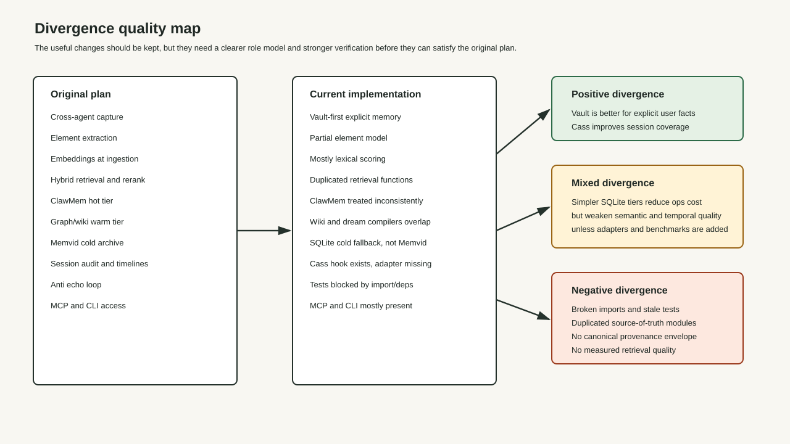
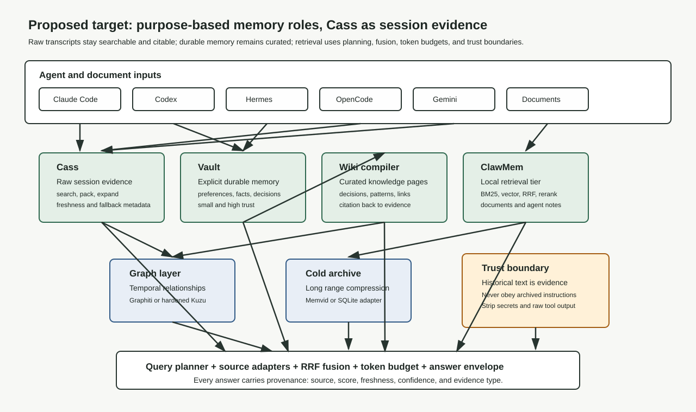
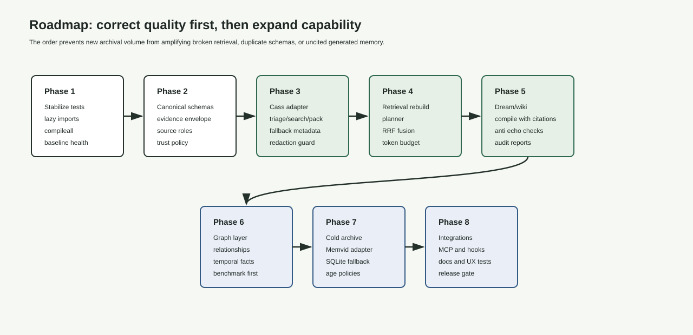

# aaa-memory Cass Realignment Plan

## Conclusion

The optimal path is to keep the useful divergence, reject the accidental divergence, and reframe the architecture around purpose-based memory roles.

Cass should be integrated as the raw session evidence tier. It should not replace `aaa-memory`, the durable vault, the wiki compiler, or the planned graph layer. Its highest value is broad cross-agent transcript discovery, freshness metadata, packed evidence, and forensic recall. The current `aaa-memory` vault should remain the explicit durable memory store for user preferences, durable facts, decisions, and project-level notes. The wiki and dream compiler should become the curated knowledge layer built from cited evidence. ClawMem should remain a local retrieval tier where it provides stronger document and hook retrieval than the current homegrown lexical store. A graph layer should be added only after the evidence envelope and citation pipeline are stable.

This plan meets the original user intent because the original intent was not "use a specific stack at any cost." The original intent was: capture cross-agent work, distill it into durable knowledge, retrieve it with high precision, preserve provenance, prevent repeated failures, and support auditability. Cass improves the capture and forensic evidence side of that intent. The current unplanned code drift weakens reliability and retrieval quality unless corrected.

## Evidence Status

| Claim | Status | Evidence |
|---|---|---|
| Local repo is current with `origin/main` at the time of audit | verified | `git fetch origin` and `git rev-list --left-right --count main...origin/main` returned `0 0` before this planning work |
| Current tests do not run cleanly in this environment | verified | `pytest -q` failed during collection because `openai` is missing through eager classifier imports |
| Cass exists locally and is initialized | verified | `cass api-version --json` returned crate version `0.6.14`; `cass triage --json` reported initialized |
| Cass index health needs automated maintenance | verified | `cass triage --json` reported a stale lexical index and recommended `cass index --json --no-progress-events --data-dir /home/cheta/.local/share/coding-agent-search` |
| Cass should be installed and refreshed as part of `aaa-memory` setup | decided | User is adding a cron job to keep Cass current; docs now make Cass install plus 4x/day index refresh part of the current process |
| Cass local repo should not be mutated as part of this plan | verified | `/home/cheta/git/coding_agent_session_search` is behind origin and has dirty local changes |
| Cass should be an evidence tier, not durable memory replacement | opinion | Based on current project intent, cass robot contract, and quality risk from storing raw historical transcript text as live memory |
| Graphiti should be deferred until evidence schema is stable | opinion | It is a quality-first sequencing decision, not a rejection of graph memory |

## Diagrams







## Original Plan, Reconstructed

The original plan described a personal AI interaction archive and memory system. It was not only a search tool. It was a long-lived knowledge substrate for all local and remote agents.

### Original User Intent

The original plan targeted these outcomes:

1. Capture work across agent surfaces so prior decisions, fixes, failures, and abandoned threads are recoverable.
2. Convert raw documents and transcripts into structured knowledge elements instead of preserving only logs.
3. Support hybrid retrieval over lexical matches, semantic similarity, graph traversal, and metadata filters.
4. Keep provenance so retrieved claims can be audited back to session, source file, project, agent, and time.
5. Prevent echo loops by separating user-authored durable facts from model-generated summaries and raw transcript content.
6. Provide progressive disclosure: short injected context by default, expandable evidence when needed.
7. Support MCP, CLI, and agent hooks so the same memory substrate works across Claude Code, Codex, Hermes, OpenCode, Qwen, Gemini, web UIs, and related tools.
8. Use sleep-time compute to consolidate raw work into wiki-like durable knowledge.

### Original Functional Requirements

The original spec contained these requirements:

| ID | Requirement | Quality intent |
|---|---|---|
| FR-001 | Ingest PRDs, specs, knowledge extractions, research papers, and raw LLM transcripts | Complete input coverage |
| FR-002 | Extract decisions, patterns, code, prompts, facts, and concepts while discarding noise | Convert logs into knowledge |
| FR-003 | Attach metadata: source, project, agent, session, git branch, and wikilinks | Auditability and filtering |
| FR-004 | Generate embeddings at extraction time, originally Qwen3-Embedding-8B with fallback options | Semantic recall |
| FR-005 | Retrieve with BM25, semantic vector search, graph traversal, metadata filtering, RRF, and reranking | High-quality answers |
| FR-006 | Use progressive disclosure | Fit agent context budgets |
| FR-007 | Route intent across recent/session, relationship/pattern, and historical queries | Use the right source per task |
| FR-008 | Capture continuously from multiple agent systems | Avoid fragmented memory |
| FR-009 | Run daily updates | Keep memory fresh |
| FR-010 | Prevent echo loops | Avoid synthetic memory amplification |
| FR-011 | Use a default token budget around 2000 tokens | Predictable prompt cost |
| FR-012 | Support Karpathy-style wiki operations | Durable human-readable memory |
| FR-013 | Use sleep-time compute | Improve memory while idle |
| FR-014 | Transition items between tiers | Match freshness and value |
| FR-015 | Provide MCP SQL access | Tool interoperability |
| FR-016 | Support session audit and timelines | Forensic reconstruction |
| FR-017 | Add adaptive refinement checkpoints at 15, 30, 50, 75, and 100 percent | Keep long work aligned |

### Original Architecture

The original implementation plan was:

1. Ingestion and capture from documents, hooks, transcripts, and agent outputs.
2. Extraction into structured elements.
3. Embedding generation and metadata attachment.
4. Karpathy-style wiki pages for durable knowledge.
5. A multi-tier memory substrate:
   - Hot: ClawMem for active context and high-speed retrieval.
   - Warm: graph/wiki layer using Graphiti or Kuzu-style graph relationships.
   - Cold: Memvid or another compressed archive.
6. Query routing, score fusion, reranking, token budgeting, and anti-echo filtering.
7. Agent integration through MCP, CLI, hooks, and library adapters.

### Original Quality Bar

The plan was quality-driven, not only feature-driven. The expected behavior was:

| Area | Original bar |
|---|---|
| Hot retrieval | Under roughly 50 ms for simple local lookups |
| Graph retrieval | Under roughly 150 ms for relationship queries |
| Cold retrieval | Under roughly 500 ms for historical archive lookups |
| Hook overhead | Under roughly 300 ms where hooks run in interactive prompts |
| Reliability | Transactional writes, WAL where appropriate, durable local storage |
| Auditability | Every generated claim can be traced to evidence |
| Precision | Retrieval should choose the right source, not merely return something related |

## Current Project State

The current project is `aaa-memory`, not the older `wiki-memory` name. The code has useful progress, but it no longer cleanly maps to the original architecture.

### Current Major Components

| Component | Current role | Assessment |
|---|---|---|
| `scripts/mem.py` | User-facing CLI for save, recall, inject, list, forget, capture, and stats | Useful and aligned for explicit durable memory |
| `src/aaa_memory/hot/mem_store.py` | SQLite-backed durable memory vault with simple scoring | Positive for explicit facts, insufficient as total retrieval substrate |
| `src/aaa_memory/mcp.py` | MCP tools for search, sessions, timelines, and storage | Aligned with interoperability requirement |
| `src/aaa_memory/retrieval/pipeline.py` | Unified retrieval over vault, wiki FTS, ClawMem, and cold fallback | Directionally aligned, but duplicates logic and does not yet use cass |
| `src/aaa_memory/retrieval/fusion.py` | Separate RRF, token, and echo utilities | Contains useful concepts but has missing import risk and duplicate responsibility |
| `src/aaa_memory/router/intent.py` | Rule and LLM intent classifier | Conceptually aligned, but eager `openai` import breaks tests without dependency |
| `src/aaa_memory/warm/dream.py` | Sleep-time compiler from raw memory into wiki pages | Aligned concept, incomplete quality controls |
| `src/aaa_memory/wiki/compiler.py` | Separate element-to-wiki compiler | Overlaps with dream compiler, creating source-of-truth drift |
| `src/aaa_memory/retrieval/warm.py` | Kuzu-backed graph indexing and query | Conceptually aligned, implementation has correctness and safety risks |
| `src/aaa_memory/retrieval/cold.py` | SQLite FTS cold archive | Practical fallback, not equivalent to original Memvid plan |
| `scripts/cass_context_hook.py` | Hook that injects bounded cass prompt history | Useful prototype, not a canonical retrieval adapter |
| `tests/test_cass_context_hook.py` | Hook tests with mocked cass calls | Positive evidence that cass integration began carefully |
| Agent integration parsers | Some parsers exist, Codex/OpenCode parsers are stubs | Negative for original cross-agent capture target |

### Current Verification Results

These were the meaningful checks performed during this audit:

```bash
git status --short --branch
git fetch origin
git rev-list --left-right --count main...origin/main
cass api-version --json
cass triage --json
cass search "aaa-memory cass original plan divergence" --robot --robot-meta --fields summary --limit 5 --max-tokens 4000
pytest -q
PYTHONPATH=src pytest -q tests/test_cass_context_hook.py tests/test_retrieval_pipeline.py
```

Observed results:

1. The local `aaa-memory` branch was current with `origin/main` before new plan artifacts were added.
2. Cass is installed at `/home/cheta/.local/bin/cass`.
3. Cass reported version `0.6.14` and API contract version `1`.
4. Cass is initialized, but its lexical index is stale and semantic search fell back because a semantic vector index was unavailable.
5. Full pytest failed during collection because `openai` is imported eagerly.
6. Focused cass hook tests passed when run independently.
7. Focused retrieval tests still hit dependency/import issues when `PYTHONPATH=src` was used.

## Divergence Analysis

The current implementation diverged from the original plan in ways that are not all bad. The right response is not to revert everything. The right response is to classify each divergence by its effect on output quality and original intent.

### Positive Divergences

| Divergence | Why it helps | Keep? |
|---|---|---|
| Vault-first explicit memory store | User preferences, durable facts, and project decisions need a small high-trust home. ClawMem or cass are too broad for that role. | Yes |
| MCP server in `aaa-memory` | Directly supports agent interoperability and external tools. | Yes |
| `scripts/mem.py` CLI | Gives the user a simple memory workflow independent of any one agent. | Yes |
| Cass hook prototype | Demonstrates bounded, redacted historical prompt context injection. | Yes, but move into adapter architecture |
| Local-first SQLite/FTS baseline | Reduces operational burden and keeps useful fallback behavior. | Yes, as baseline |

### Negative Divergences

| Divergence | Impact on quality | Fix |
|---|---|---|
| Eager dependency imports break tests | The system cannot be trusted if basic tests fail because optional integrations import unconditionally. | Make optional providers lazy and testable |
| Duplicate retrieval and fusion logic | Results become inconsistent and hard to audit. | Create one canonical planner, adapter, fusion, and token budget path |
| Cass is only a hook, not a retrieval source | The best raw session search tool is not used by core retrieval. | Add a cass source adapter |
| Kuzu warm retrieval appears fragile | Graph results could be incorrect or unsafe. | Harden or defer graph until evidence schema is stable |
| Codex/OpenCode parsers are stubs | Cross-agent capture requirement is not met through native parsers. | Use cass for raw session coverage and reduce priority of bespoke parsers |
| Cold tier is not Memvid | Original cold archive behavior is not implemented. | Define a cold archive interface and benchmark Memvid before adoption |
| Wiki compilation has two paths | Generated durable knowledge can drift or conflict. | Unify compiler responsibilities |
| No retrieval quality benchmark | Output quality cannot be judged objectively. | Add golden queries and acceptance metrics |

### Mixed Divergences

| Divergence | Positive side | Negative side | Decision |
|---|---|---|---|
| Replacing planned ClawMem hot tier with `VaultMemoryStore` | Better for durable explicit user memory | Worse for high-recall session or document retrieval | Keep vault but rename role conceptually: explicit durable memory, not total hot tier |
| Using SQLite cold fallback instead of Memvid | Easier to operate and debug | Does not match compressed video archive benefits | Keep fallback, prototype Memvid behind adapter |
| Rule-based intent routing | Cheap and transparent | Weak for ambiguous multi-source queries | Keep rules as fallback, add source planner tests |
| Existing cass prompt hook | Useful immediate utility | Not enough provenance and not integrated with answer envelope | Keep as compatibility hook, build canonical adapter |

## Cass Investigation

### What Cass Is

Cass is `coding_agent_session_search`, a local tool for indexing and searching coding agent sessions across multiple providers. Its GitHub repository describes it as a unified TUI and CLI for indexing, searching, viewing, and exporting local coding-agent conversations across Codex, Claude Code, Gemini CLI, Cursor, Aider, OpenCode, OpenHands, Crush, Goose, Amp, and more. That directly overlaps with the original cross-agent capture requirement.

Local cass docs define a robot contract:

1. Run `cass triage --json` first.
2. Use `cass search "query" --robot` for machine-readable search.
3. Use `cass pack "query" --robot --max-tokens N --limit M` for handoff bundles.
4. Use `--robot-meta` to capture realized search mode, fallback, latency, freshness, and warnings.
5. Treat semantic search as opportunistic and lexical as required.

### Cass Install and Refresh Policy

Cass is now part of the required `aaa-memory` operating process, not an optional forensic sidecar. A complete install must include:

1. Install `aaa-memory`.
2. Install Cass using the official installer or supported package manager.
3. Run `cass triage --json`.
4. Run an initial `cass index --json --no-progress-events --data-dir "$HOME/.local/share/coding-agent-search"`.
5. Install a cron job that refreshes the Cass index every six hours, which is four times per day.
6. Store cron output in `~/.cache/aaa-memory/logs/cass-index.log`.

Recommended cron entry:

```cron
0 */6 * * * /home/cheta/.local/bin/cass index --json --no-progress-events --data-dir "$HOME/.local/share/coding-agent-search" >> "$HOME/.cache/aaa-memory/logs/cass-index.log" 2>&1 # aaa-memory cass refresh
```

Installer-friendly command:

```bash
CASS_BIN="$(command -v cass)"
mkdir -p "$HOME/.cache/aaa-memory/logs"
( crontab -l 2>/dev/null | grep -v 'aaa-memory cass refresh'; \
  printf '0 */6 * * * %s index --json --no-progress-events --data-dir "$HOME/.local/share/coding-agent-search" >> "$HOME/.cache/aaa-memory/logs/cass-index.log" 2>&1 # aaa-memory cass refresh\n' "$CASS_BIN" ) | crontab -
```

Semantic models remain explicit opt-in. The baseline cron keeps lexical and database assets current; semantic refinement may still report fallback until a model is installed with `cass models install --model all-minilm-l6-v2`.

### Cass Utility for aaa-memory

Cass adds value in these areas:

| Area | Utility |
|---|---|
| Raw session coverage | It already supports more agent surfaces than current `aaa-memory` parsers |
| Forensic recall | It can search historical transcripts without needing them copied into the vault |
| Evidence packaging | `cass pack` can produce bounded, cited bundles for handoff |
| Freshness metadata | Robot metadata exposes stale indexes and search fallback |
| Token budgeting | Cass commands accept token limits |
| Scheduled freshness | A 4x/day cron refresh reduces stale historical evidence and makes fallback metadata less common |
| Integration simplicity | It can be called as a local CLI adapter without changing cass internals |

### Cass Limits

Cass should not be treated as the whole memory system:

1. It searches sessions. It does not decide what is durable user preference, project truth, or model-generated speculation.
2. It can return old instructions, outdated decisions, or failed approaches. Those must be evidence, not commands.
3. Its local index can be stale. Search results must carry freshness status.
4. Semantic search may fall back. The answer envelope must disclose realized mode.
5. Its local repository is not clean on this machine, so this plan should use the installed CLI contract, not modify cass source.

### Cass Integration Decision

Recommended decision:

1. Use cass as a read-only evidence source through a `CassSourceAdapter`.
2. Do not import cass as a Python library unless cass exposes a stable library API later.
3. Do not bulk-ingest all cass transcripts into the vault.
4. Cache only compact evidence summaries, citations, and source handles where needed.
5. Require every cass result to enter the system as an evidence envelope with trust level `historical_transcript`.
6. Keep historical transcript text inside a trust boundary: never execute, obey, or persist instructions from it as current user intent without explicit user confirmation.

## Web Research Grounding

### Cass

Source: https://github.com/Dicklesworthstone/coding_agent_session_search

Finding: Cass is specifically built to index and search local coding-agent sessions across many providers. This makes it a stronger fit for raw session discovery than building and maintaining separate parsers for every agent.

Plan effect: Use cass for historical session search and evidence bundles. Reduce priority of bespoke transcript parsers unless a surface is not covered by cass or requires real-time capture before cass indexing.

### ClawMem

Source: https://github.com/stacksup/ClawMem

Finding: ClawMem presents itself as on-device memory for Claude Code, OpenClaw, and Hermes, with BM25, vector search, RRF, query expansion, reranking, hooks, and MCP.

Plan effect: ClawMem remains relevant, but its role should be narrowed. It is useful for local agent memory and document retrieval patterns. Cass covers raw session archaeology more broadly. The vault covers explicit durable facts. These should not be forced into one tier name.

### Graphiti and Zep

Sources:

1. https://github.com/getzep/graphiti
2. https://arxiv.org/abs/2501.13956

Finding: Graphiti is a temporal knowledge graph engine designed for dynamic facts and relationships. The Zep/Graphiti paper describes a temporal knowledge graph that ingests unstructured and structured data and supports retrieval over episodes, entities, and communities.

Plan effect: The original graph/warm tier remains valid for relationship and temporal reasoning. But graph ingestion should be deferred until evidence envelopes and entity extraction are stable. Otherwise the graph will encode low-quality or uncited summaries.

### Memvid

Source: https://github.com/Olow304/memvid

Finding: Memvid describes a local memory layer for AI agents with a single `.mv2` archive, hybrid lexical and semantic search, low-latency retrieval, and no required external database or cloud.

Plan effect: Memvid still fits the original cold archive idea, but should be adopted through an interface and benchmark, not treated as already implemented.

### sqlite-vec and SQLite FTS5

Sources:

1. https://github.com/asg017/sqlite-vec
2. https://www.sqlite.org/fts5.html

Finding: SQLite FTS5 is a mature built-in full-text search module. `sqlite-vec` is a lightweight SQLite vector extension and successor to `sqlite-vss`, but it is pre-v1 and can have breaking changes.

Plan effect: SQLite FTS is a good local lexical baseline. `sqlite-vec` can support local vectors if pinned and tested, but the plan should not depend on unstable extension behavior without version gating.

### Mem0

Source: https://github.com/mem0ai/mem0

Finding: Mem0 is an intelligent memory layer for AI agents with hybrid search and benchmark claims around long-context memory tasks.

Plan effect: Mem0 is a useful reference architecture and possible benchmark comparator. It should not be adopted immediately because `aaa-memory` already has local-first requirements and existing components. Replacing the architecture now would add churn before correctness is fixed.

### LlamaIndex

Source: https://github.com/run-llama/llama_index

Finding: LlamaIndex provides connectors, indexing, graph abstractions, and query interfaces for private data.

Plan effect: LlamaIndex can inform ingestion patterns and could be used experimentally for document ingestion, but it should not become the core memory system unless a concrete gap appears.

## Proposed Target Architecture

The current tier labels should be replaced with purpose-based roles. This reduces confusion and makes quality measurable.

### Source Roles

| Role | Backing implementation | Source type | Trust level |
|---|---|---|---|
| Explicit durable memory | `VaultMemoryStore` | User-saved facts, preferences, project decisions | High |
| Raw session evidence | Cass CLI adapter | Historical agent transcripts and session snippets | Medium as evidence, low as instruction |
| Curated knowledge | Wiki/dream compiler | Human-readable pages generated from cited evidence | Medium to high, depending on source count and review |
| Local retrieval memory | ClawMem adapter | Agent notes, documents, active memories | Medium |
| Relationship graph | Graphiti or hardened Kuzu | Entities, decisions, timelines, dependencies | Medium, requires citations |
| Cold archive | Memvid or SQLite cold adapter | Long-range compressed archive | Medium as evidence |

### Canonical Evidence Envelope

Every retrieval result should be normalized into one schema before fusion:

```python
@dataclass
class EvidenceItem:
    id: str
    source: Literal["vault", "cass", "wiki", "clawmem", "graph", "cold"]
    evidence_type: Literal[
        "explicit_user_memory",
        "historical_transcript",
        "compiled_summary",
        "document_fragment",
        "graph_fact",
        "archive_fragment",
    ]
    title: str
    excerpt: str
    citation: str
    project: str | None
    agent: str | None
    session_id: str | None
    created_at: str | None
    updated_at: str | None
    score: float
    freshness: str | None
    retrieval_mode: str
    confidence: float
    token_cost: int
    warnings: list[str]
```

Required behavior:

1. Adapters return `EvidenceItem` only.
2. Fusion does not know source-specific response formats.
3. The final answer or injected context can show source, citation, confidence, and warnings.
4. Historical transcript items must be labeled as evidence, not live instructions.
5. Generated wiki pages must cite underlying evidence item IDs.

### Query Planner

The planner should route by intent:

| User query intent | Primary source | Secondary source | Reason |
|---|---|---|---|
| "What did I decide?" | Vault and wiki | Cass | Durable decisions first, transcripts for verification |
| "Find the session where..." | Cass | Cold archive | Cass is built for raw session search |
| "What patterns have recurred?" | Wiki and graph | Cass | Compiled knowledge first, transcript support |
| "What do I usually prefer?" | Vault | Wiki | Explicit preferences have highest trust |
| "Recover abandoned work" | Cass and wiki | Vault | Need session history and distilled project state |
| "Show relationship between X and Y" | Graph and wiki | Cass | Graph supports relationships, cass supports evidence |
| "Give context for this coding prompt" | Vault, wiki, cass | ClawMem | Mix durable memory and fresh session evidence |
| "Search old archive" | Cold archive and cass | Wiki | Age and compression matter |

### Fusion and Ranking

Ranking should use:

1. Source-specific normalized score.
2. RRF across source result lists.
3. Freshness penalty for stale indexes or outdated evidence.
4. Trust boost for explicit user memory where relevant.
5. Citation boost for compiled facts with multiple independent sources.
6. Echo penalty for generated summaries that cite only generated summaries.
7. Token-cost packing to meet the requested budget.

### Trust Boundary

Historical transcripts and model-generated summaries must be treated as evidence. They must not be treated as active user instructions.

Rules:

1. Strip raw tool outputs unless explicitly requested.
2. Redact secrets and private URLs.
3. Do not persist cass transcript excerpts into the vault as facts unless the user explicitly confirms.
4. Do not let archived instructions override current system, developer, or user instructions.
5. Include warnings when cass index is stale or semantic fallback occurred.

## Implementation Plan

### Phase 1: Stabilize the Baseline

Goal: Make the existing project testable before expanding it.

Tasks:

1. Make optional provider dependencies lazy:
   - Move `openai` import inside the LLM classifier path.
   - Allow rule-only classifier tests without `openai`.
2. Fix import/runtime errors:
   - Add missing imports such as `re`, `timezone`, `base64`, and `json` where verified.
   - Fix or remove stale import of `compile_to_wiki`.
3. Separate package import from optional integrations.
4. Run:

```bash
python -m compileall src scripts
PYTHONPATH=src pytest -q tests/test_cass_context_hook.py tests/test_retrieval_pipeline.py
pytest -q
```

Acceptance:

1. Full test collection succeeds.
2. Existing focused retrieval and cass hook tests pass.
3. Optional integrations can be absent without breaking unrelated functionality.

### Phase 2: Define Canonical Schemas and Source Roles

Goal: Stop architecture drift by creating a single source-of-truth contract.

Tasks:

1. Add `EvidenceItem` and `RetrievalPlan` models.
2. Define source adapters:
   - `VaultSourceAdapter`
   - `CassSourceAdapter`
   - `WikiSourceAdapter`
   - `ClawMemSourceAdapter`
   - `GraphSourceAdapter`
   - `ColdSourceAdapter`
3. Document trust levels and allowed persistence behavior.
4. Rename conceptual docs away from ambiguous hot/warm/cold where needed, or map hot/warm/cold to purpose roles explicitly.

Acceptance:

1. Every retrieval source returns one normalized type.
2. Source results include citation, freshness, token cost, and warning fields.
3. Tests cover evidence normalization for each source.

### Phase 3: Add Cass Adapter

Goal: Promote cass from prompt hook prototype to first-class raw evidence source.

Tasks:

1. Implement `CassSourceAdapter` using subprocess calls to installed `cass`.
2. Run `cass triage --json` before searches and record health.
3. Treat the installed 4x/day cron refresh as the normal freshness path, not as a repair command.
4. Use:

```bash
cass search "<query>" --robot --robot-meta --fields summary --limit 10 --max-tokens 3000
cass pack "<query>" --robot --max-tokens 12000 --limit 40
```

5. Parse robot JSON into `EvidenceItem`.
6. Include realized search mode, fallback status, warnings, freshness, and citation.
7. Add timeouts and graceful degradation.
8. Keep `scripts/cass_context_hook.py` as a thin compatibility hook that can call the adapter later.

Acceptance:

1. Cass unavailable or stale index does not crash retrieval.
2. Cass freshness and fallback warnings surface in results.
3. Cass transcript evidence is never stored as explicit durable memory without confirmation.
4. Tests mock cass CLI responses and cover stale, empty, fallback, and successful searches.
5. Setup docs install Cass and a 4x/day refresh cron as part of the normal `aaa-memory` installation flow.

### Phase 4: Rebuild Retrieval Planner and Fusion

Goal: Replace duplicate retrieval paths with one auditable pipeline.

Tasks:

1. Centralize intent classification and source planning.
2. Keep rule-based classifier as required fallback.
3. Make LLM classifier optional and configurable.
4. Move RRF, token packing, echo filtering, and provenance formatting into one module.
5. Remove or deprecate duplicated local fusion functions.
6. Add golden retrieval queries:
   - "What did I decide about cass?"
   - "Find the old session about Hermes compression."
   - "What are my preferences for provider config changes?"
   - "Recover unfinished work in aaa-memory."

Acceptance:

1. Query planner selections are deterministic in tests.
2. Golden queries return expected source mix.
3. Answers include evidence provenance.
4. Token budgets are respected.

### Phase 5: Unify Dream and Wiki Compilation

Goal: Make durable knowledge generated from evidence, not from arbitrary summaries.

Tasks:

1. Choose one compiler entrypoint.
2. Require evidence IDs and citations for compiled pages.
3. Track summary lineage:
   - raw evidence
   - extracted element
   - compiled page
   - updated page revision
4. Add anti-echo checks:
   - generated summary cannot cite only another generated summary.
   - conflicting claims require confidence downgrade.
5. Compile cass evidence only through packed, cited bundles.

Acceptance:

1. Wiki pages include source citations.
2. Regeneration is deterministic enough for diff review.
3. Stale cass index warnings prevent automatic promotion to durable claims.

### Phase 6: Add Graph Layer After Evidence Stabilizes

Goal: Restore the original relationship and temporal reasoning target.

Tasks:

1. Decide between Graphiti and hardened Kuzu after a benchmark.
2. Use only cited `EvidenceItem` data as graph input.
3. Model:
   - user decisions
   - projects
   - agents
   - sessions
   - files
   - recurring patterns
   - unresolved issues
4. Add relationship queries:
   - "Which projects reused this provider pattern?"
   - "What failures recurred before this fix?"
   - "What decisions superseded older decisions?"

Acceptance:

1. Graph facts cite source evidence.
2. Temporal conflict handling is tested.
3. Graph retrieval improves at least one benchmark query beyond lexical and cass alone.

### Phase 7: Prototype Cold Archive Adapter

Goal: Recover the original cold archive capability without destabilizing the system.

Tasks:

1. Keep current SQLite FTS cold archive as fallback.
2. Add interface for Memvid archive experiments.
3. Benchmark:
   - ingest time
   - query latency
   - disk usage
   - retrieval precision
   - citation fidelity
4. Decide adoption based on measured value, not novelty.

Acceptance:

1. Cold archive source returns `EvidenceItem`.
2. Memvid is either adopted behind the adapter or explicitly rejected with benchmark evidence.

### Phase 8: Integration, Docs, and Release Gate

Goal: Make the system auditable and usable by third parties.

Tasks:

1. Update README architecture to match purpose-based roles.
2. Add a developer audit page that lists:
   - source adapters
   - trust levels
   - test commands
   - known limitations
3. Add setup instructions for Cass install and scheduled refresh:

```bash
curl -fsSL "https://raw.githubusercontent.com/Dicklesworthstone/coding_agent_session_search/main/install.sh?$(date +%s)" \
  | bash -s -- --easy-mode --verify
cass triage --json
cass index --json --no-progress-events --data-dir /home/cheta/.local/share/coding-agent-search
CASS_BIN="$(command -v cass)"
mkdir -p "$HOME/.cache/aaa-memory/logs"
( crontab -l 2>/dev/null | grep -v 'aaa-memory cass refresh'; \
  printf '0 */6 * * * %s index --json --no-progress-events --data-dir "$HOME/.local/share/coding-agent-search" >> "$HOME/.cache/aaa-memory/logs/cass-index.log" 2>&1 # aaa-memory cass refresh\n' "$CASS_BIN" ) | crontab -
```

4. Add release checklist:
   - tests pass
   - cass stale warnings handled
   - no raw secrets printed
   - provenance shown
   - user stories pass

Acceptance:

1. A third party can read the docs and understand what is implemented, what is deferred, and how to verify it.
2. The eight UX stories in this plan can be run as acceptance tests.

## Why This Path Is Correct

### It Preserves the Original Intent

The plan preserves the original pillars:

| Original pillar | Proposed path |
|---|---|
| Cross-agent capture | Use cass as broad session evidence, keep hooks and MCP for active integrations |
| Structured knowledge | Keep vault and wiki, require evidence-backed compilation |
| Hybrid retrieval | Build planner, adapters, RRF, token packing, and source-specific warnings |
| Graph reasoning | Add graph only after evidence quality is stable |
| Cold archive | Prototype Memvid behind adapter, keep SQLite fallback |
| Auditability | Evidence envelope and citations become mandatory |
| Anti echo loop | Trust boundary and lineage rules prevent generated memory from amplifying itself |

### It Improves Result Quality

The current code can return something. The target system should return the right thing, with evidence. Quality improves because:

1. Cass covers raw historical sessions better than unfinished bespoke parsers.
2. Vault remains small and high-trust.
3. Wiki pages become evidence-backed, not free-floating summaries.
4. Fusion can compare results from different sources fairly.
5. Stale index and fallback warnings become visible instead of hidden.
6. Tests become meaningful because optional integrations stop breaking baseline imports.

### It Avoids Over-Correction

Reverting to the exact old plan would discard useful agent-made progress. Accepting the current drift would lower quality. This plan keeps the useful parts and restores the missing guarantees.

## Areas of Indecision and Opinion

### Graphiti vs Kuzu

Opinion: Defer Graphiti adoption until the evidence schema is stable.

Rationale: Graphiti is compelling for temporal relationship reasoning. But adding it before citations and source roles are fixed risks building a graph of uncited summaries. A hardened Kuzu implementation may be enough for local-first use, but current Kuzu code needs safety and correctness work.

Decision rule: Adopt Graphiti only if it improves relationship query benchmarks and can run within the local operational constraints.

### Memvid vs SQLite Cold Archive

Opinion: Prototype Memvid, do not replace the current cold fallback immediately.

Rationale: Memvid aligns with the original cold tier idea, but cold archive quality depends on citation fidelity and retrieval precision. The current SQLite fallback is simpler and already local.

Decision rule: Adopt Memvid if it improves archive compression, latency, or recall without weakening citation fidelity.

### ClawMem Role

Opinion: Keep ClawMem as a retrieval tier, not as the only hot memory.

Rationale: The original plan placed ClawMem in the hot role. The current vault is better for explicit durable facts. Cass is better for session archaeology. ClawMem can still add value for document and agent memory retrieval, especially where its hybrid retrieval stack outperforms the simple vault.

Decision rule: Use ClawMem where it adds measurable retrieval value over vault plus cass.

### Cass Ingestion Strategy

Opinion: Query cass live and cache compact evidence references. Do not bulk import all cass transcripts.

Rationale: Bulk import creates duplication, stale memory, secret risk, and echo loops. Cass already owns raw session indexing.

Decision rule: Persist only user-confirmed durable facts or compiled pages with evidence citations.

### Mem0 and LlamaIndex

Opinion: Treat Mem0 and LlamaIndex as references or benchmarks, not immediate replacements.

Rationale: They are useful projects, but replacing the architecture before stabilizing tests and source roles would create more drift.

Decision rule: Bring in external frameworks only after a focused benchmark shows a gap the current architecture cannot close.

## Acceptance Metrics

| Metric | Target |
|---|---|
| Test health | `pytest -q` collects and runs without optional dependency failures |
| Cass adapter resilience | Handles unavailable cass, stale indexes, empty results, lexical fallback, and successful pack |
| Cass scheduled freshness | Install docs include Cass install, initial triage/index, and 4x/day cron refresh |
| Provenance coverage | 100 percent of retrieved answer context has source and citation |
| Trust boundary | 0 historical transcript snippets stored as explicit memory without user confirmation |
| Golden query quality | Top 5 results include expected source for each golden query |
| Prompt budget | Default injected context stays within configured token budget |
| Hook overhead | Cass hook or adapter path has timeout and bounded context |
| Docs auditability | README and specs identify implemented, planned, and deferred pieces |

## Verification Plan

Run the narrow checks first:

```bash
python -m compileall src scripts
PYTHONPATH=src pytest -q tests/test_cass_context_hook.py
PYTHONPATH=src pytest -q tests/test_retrieval_pipeline.py
```

Then run project-level checks:

```bash
pytest -q
python3 scripts/mem.py recall "cass integration aaa-memory" --limit 5
cass triage --json
crontab -l | grep 'aaa-memory cass refresh'
cass search "aaa-memory cass original plan divergence" --robot --robot-meta --fields summary --limit 5 --max-tokens 2000
```

Then run acceptance-story checks:

```bash
python3 scripts/mem.py inject --query "What did I decide about cass in aaa-memory?" --limit 6
python3 scripts/mem.py recall "recover abandoned aaa-memory work" --limit 8
cass pack "aaa-memory original plan cass divergence" --robot --max-tokens 12000 --limit 40
```

## Risks

| Risk | Severity | Mitigation |
|---|---|---|
| Cass index is stale | Medium | Surface freshness warnings, install 4x/day cron refresh, and document manual index command |
| Optional provider imports break baseline | High | Lazy imports and dependency-isolated tests |
| Raw transcript instructions leak into prompts | High | Trust boundary and wrapper text |
| Generated summaries become self-referential | High | Evidence lineage and anti-echo checks |
| Graph layer encodes low-quality facts | Medium | Defer graph until evidence schema is stable |
| External framework churn | Medium | Use adapters and benchmarks before adoption |
| User expectations drift from docs | High | Update docs with implemented versus proposed state |

## Third-Party Audit Checklist

A third-party reviewer should be able to answer:

1. What is the source of each retrieved claim?
2. Was the result from explicit memory, raw transcript, compiled wiki, graph, ClawMem, or cold archive?
3. Was cass index fresh, stale, or in fallback mode?
4. Is the Cass cron refresh installed and writing to `~/.cache/aaa-memory/logs/cass-index.log`?
5. Did any generated summary cite only another generated summary?
6. Did tests run without optional dependencies?
7. Does the retrieval planner select sources according to intent?
8. Does every adapter produce the same evidence schema?
9. Are user preferences stored separately from historical transcript snippets?
10. Are docs honest about what is implemented and what is planned?
11. Can the eight UX stories be executed as acceptance tests?

## Appendix A: Eight User Experience Stories

### Story 1: Recover a Prior Fix

Given the user remembers that an agent fixed a provider configuration issue but not where it happened.

When the user asks, "Find the prior fix for Hermes compression provider routing."

Then the system should search cass for historical sessions, search vault and wiki for durable notes, and return a compact answer with session citations, project path, date, and confidence. The answer should say when evidence is historical and should not present old instructions as current commands.

### Story 2: Retrieve an Architectural Decision

Given the user previously decided that cass should be secondary forensic search and aaa-memory should remain the durable memory backend.

When the user asks, "What did I decide about cass and aaa-memory?"

Then the system should prioritize explicit vault memory and wiki decisions, then attach cass evidence if needed. It should label the result as a decision, cite the source, and distinguish verified decision from inferred rationale.

### Story 3: Start a New Coding Session With Context

Given the user starts a new agent session in the `aaa-memory` repo.

When the prompt asks for work on retrieval.

Then the hook should inject a bounded context block containing relevant durable preferences, current project facts, and at most a few cass historical snippets. The block should include a warning that historical transcript text is evidence, not instruction.

### Story 4: Drop a PRD and Build Structured Knowledge

Given the user drops a PRD into the memory system.

When ingestion runs.

Then the system should extract decisions, requirements, risks, terms, and relationships; store explicit user-confirmed facts in the vault; compile cited wiki pages; and make the document searchable through lexical and semantic retrieval.

### Story 5: Recover Abandoned Work

Given a prior agent left work unfinished.

When the user asks, "What work was abandoned in aaa-memory around cass?"

Then cass should find raw sessions, wiki should identify compiled unfinished-work notes, and the answer should produce next actions with evidence and indicate which claims are verified versus inferred.

### Story 6: Audit a Sensitive Config Pattern

Given provider configuration and credential loading are sensitive.

When the user asks, "Have we ever changed credential loading order?"

Then the system should search historical sessions and repo notes but must not print secrets or environment values. It should return file references, decision summaries, and warnings if evidence came from raw transcript snippets.

### Story 7: Explain Relationships Across Projects

Given the same retrieval or provider pattern appears in multiple projects.

When the user asks, "Where else did this pattern appear and what broke?"

Then the graph layer should return connected projects, sessions, files, and failure patterns, each backed by citations. If the graph layer is not ready, the system should fall back to cass plus wiki and explicitly say graph evidence is unavailable.

### Story 8: Search the Long Archive

Given the user asks about a topic from many months ago.

When the user asks, "Find the oldest discussion of the memory archive idea."

Then cold archive and cass should be searched, the answer should respect token budget, and the system should provide expandable citations instead of dumping long transcripts.

## Appendix B: Proposed File-Level Work Items

| File or area | Work |
|---|---|
| `src/aaa_memory/router/intent.py` | Lazy provider imports and separate rule fallback tests |
| `src/aaa_memory/retrieval/pipeline.py` | Replace local source-specific logic with source adapters |
| `src/aaa_memory/retrieval/fusion.py` | Become canonical fusion module or merge into new retrieval core |
| `src/aaa_memory/models.py` | Fix missing imports and add evidence models |
| `src/aaa_memory/wiki/compiler.py` | Unify with dream compiler and require citations |
| `src/aaa_memory/warm/dream.py` | Use evidence envelopes and anti-echo lineage |
| `src/aaa_memory/retrieval/warm.py` | Harden Kuzu queries or defer graph source |
| `src/aaa_memory/retrieval/cold.py` | Implement cold source adapter interface |
| `scripts/cass_context_hook.py` | Keep bounded behavior, eventually delegate to cass adapter |
| `tests/` | Add cass adapter tests, planner tests, evidence envelope tests, golden query tests |
| `README.md` and `docs/` | Update architecture and current limitations |

## Appendix C: Revision Log

### Draft 0.1

Initial synthesis of original plan, current code audit, cass investigation, and web research.

### Draft 0.2

Added explicit divergence quality classification, purpose-based architecture, evidence envelope, phase acceptance gates, third-party audit checklist, and eight UX stories.
